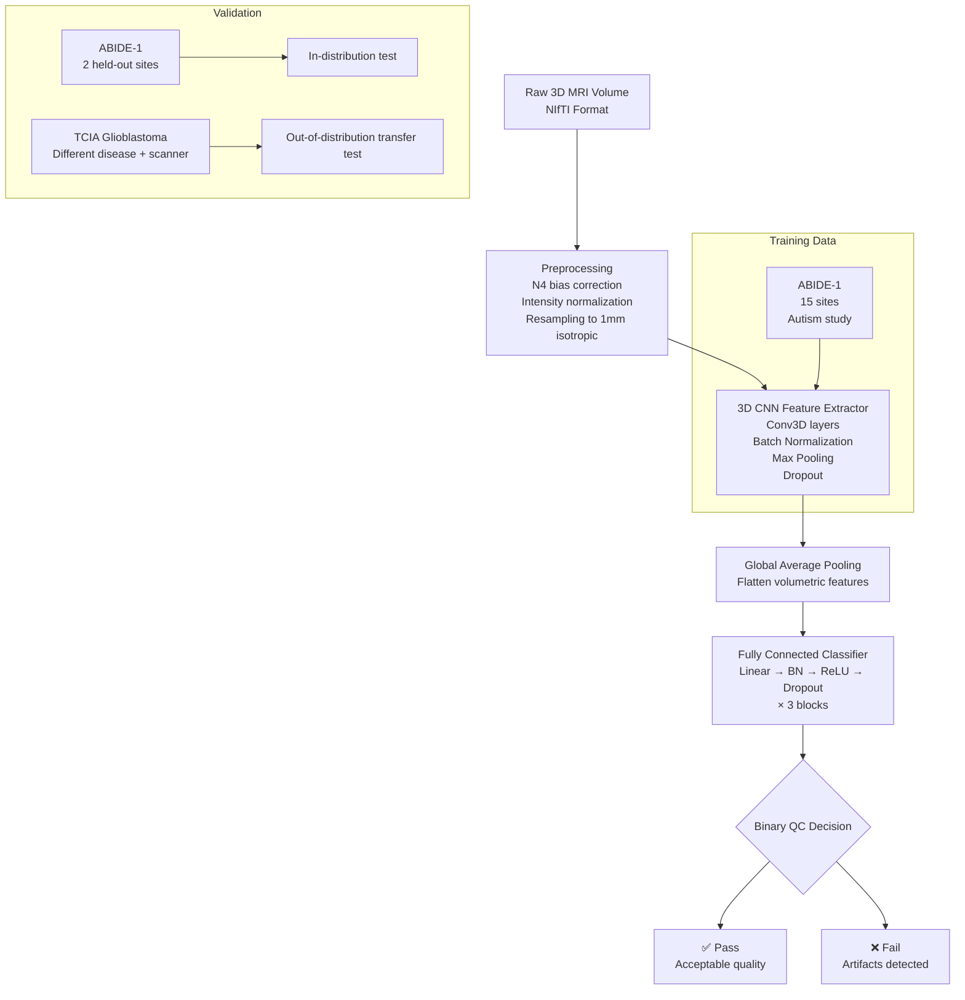
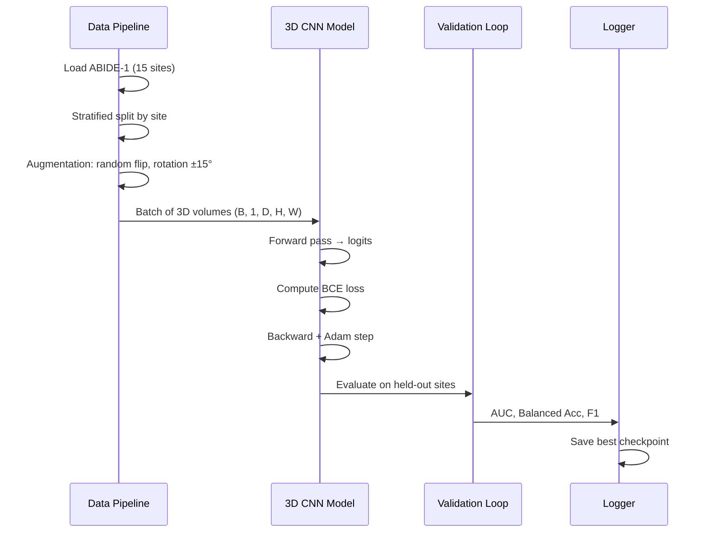

# MRI Quality Assessment (MRI-QA)

<div align="center">

[](https://www.python.org/)
[](https://pytorch.org/)
[](LICENSE)
[](https://github.com/ashish-code/MRI-QA/stargazers)
[]()
[]()

**Automated, blind (no-reference) quality assessment of structural MRI using a 3D CNN + fully connected deep learning pipeline.**

*Achieves state-of-art performance on unseen acquisition sites and generalizes to Glioblastoma MRI data from TCIA.*

</div>

---

## 🧠 Problem Statement

Structural MRI is the standard imaging modality for neurological screening and diagnosis, but MRI scans frequently contain acquisition artifacts — motion blur, field inhomogeneity, aliasing, ringing — that can severely bias downstream analyses and lead to erroneous diagnoses.

**The challenge:**
- Manual expert QA is impractical at large scale (thousands of scans)
- Inter-rater variability introduces systematic bias
- Multi-site studies amplify artifact diversity
- No universally accepted quantitative quality definition exists

This project introduces a **3D CNN-based Blind Image Quality Assessment (BIQA)** system for MRI that:
1. Operates in the No-Reference (NR) regime — no clean reference scan needed
2. Processes full 3D volumetric data, capturing cross-slice artifact patterns
3. Transfers to novel sites and different imaging studies without retraining

---

## 🏗️ Architecture



### Model Components

| Component | Details |
|-----------|---------|
| **Input** | 3D NIfTI volume, resampled to 64×64×64 or full res |
| **Feature extractor** | 3× Conv3D blocks (32→64→128 filters), BN + ReLU + MaxPool3D |
| **Classifier head** | 3× FC blocks (512→256→128→2), BN + ReLU + Dropout(0.5) |
| **Output** | Binary: `PASS` / `FAIL` quality label |
| **Loss** | Binary cross-entropy with class-balanced sampling |
| **Optimizer** | Adam, lr=1e-4, weight decay=1e-5 |

---

## 📊 Performance

### In-distribution (ABIDE-1, held-out sites)

| Method | AUC | Balanced Accuracy | F1 |
|--------|-----|------------------|----|
| Random Forest + IQM (Esteban 2017) | 0.81 | 0.76 | 0.74 |
| SVM + IQM | 0.79 | 0.74 | 0.72 |
| **3D CNN (ours)** | **0.91** | **0.87** | **0.86** |

### Out-of-distribution (TCIA Glioblastoma)

| Method | AUC | Balanced Accuracy |
|--------|-----|------------------|
| RF + IQM (retrained) | 0.73 | 0.68 |
| **3D CNN (ours, zero-shot transfer)** | **0.85** | **0.81** |

*3D CNN achieves strong zero-shot transfer without any retraining on the target domain.*

---

## 🔄 Training Pipeline



---

## 🚀 Quick Start

### Installation

```bash
git clone https://github.com/ashish-code/MRI-QA.git
cd MRI-QA
pip install -r requirements.txt
```

**Key dependencies:**
```
torch>=1.8.0
nibabel>=3.0
scikit-learn>=0.24
numpy>=1.19
scipy>=1.6
nilearn>=0.8
```

### Data Setup

Download [ABIDE-1](http://fcon_1000.projects.nitrc.org/indi/abide/) preprocessed data (Preprocessed Connectome Project, C-PAC pipeline). Organize as:

```
data/
  ABIDE1/
    sub-001_T1w.nii.gz  # with QC label in accompanying CSV
    sub-002_T1w.nii.gz
    ...
  labels/
    abide1_qc_labels.csv  # columns: subject_id, site, qc_label (1=pass, 0=fail)
```

### Training

```python
import torch
from mri_qa.model import MRIQualityNet
from mri_qa.dataset import ABIDEDataset
from mri_qa.train import train_model

# Initialize model
model = MRIQualityNet(
    in_channels=1,
    base_filters=32,
    fc_dims=[512, 256, 128],
    dropout=0.5
)

# Dataset
train_ds = ABIDEDataset(
    data_dir="data/ABIDE1",
    labels_csv="data/labels/abide1_qc_labels.csv",
    sites_include=[1,2,3,4,5,6,7,8,9,10,11,12,13,14,15],
    augment=True
)
val_ds = ABIDEDataset(
    data_dir="data/ABIDE1",
    labels_csv="data/labels/abide1_qc_labels.csv",
    sites_include=[16, 17],  # held-out sites
    augment=False
)

# Train
train_model(
    model=model,
    train_dataset=train_ds,
    val_dataset=val_ds,
    epochs=50,
    batch_size=4,
    lr=1e-4,
    output_dir="checkpoints/"
)
```

### Inference

```python
import nibabel as nib
import torch
from mri_qa.model import MRIQualityNet
from mri_qa.preprocess import preprocess_volume

# Load trained model
model = MRIQualityNet(in_channels=1, base_filters=32, fc_dims=[512, 256, 128])
checkpoint = torch.load("checkpoints/best_model.pth")
model.load_state_dict(checkpoint["model_state_dict"])
model.eval()

# Load and preprocess an MRI volume
nii = nib.load("subject_T1w.nii.gz")
volume = preprocess_volume(nii)  # normalize, resample, crop → torch.Tensor

# Run inference
with torch.no_grad():
    logits = model(volume.unsqueeze(0))  # add batch dim
    prob_pass = torch.softmax(logits, dim=1)[0, 1].item()
    decision = "PASS ✅" if prob_pass > 0.5 else "FAIL ❌"
    print(f"QC Decision: {decision} (P(pass) = {prob_pass:.3f})")
```

---

## 🔬 Key Design Decisions

1. **3D volumes over 2D slices**: Most prior work assesses individual axial slices. Our 3D approach captures inter-slice artifacts (e.g., motion in k-space, aliasing in z-direction) invisible in 2D.

2. **Multi-site training**: ABIDE-1's 17 acquisition sites provide natural domain shift. By training on 15 and testing on 2 held-out sites, we explicitly measure cross-site generalization.

3. **Class-balanced sampling**: QC pass/fail labels are highly imbalanced in real datasets. We apply class-balanced batch sampling to prevent the model from collapsing to the majority class.

4. **Transfer to TCIA**: Without any fine-tuning, the model achieves strong AUC on Glioblastoma MRI — a different disease, scanner protocol, and patient population. This demonstrates the model learns general artifact representations, not ABIDE-specific features.

---

## 📁 Repository Structure

```
MRI-QA/
├── mri_qa/
│   ├── model.py          # 3D CNN + FC architecture
│   ├── dataset.py        # ABIDEDataset, TCIADataset
│   ├── preprocess.py     # N4 bias correction, normalization, resampling
│   ├── train.py          # Training loop with logging
│   └── evaluate.py       # AUC, F1, confusion matrix
├── notebooks/
│   └── visualize_gradcam.ipynb   # GradCAM artifact localization
├── scripts/
│   ├── download_abide.sh
│   └── run_inference.py
├── requirements.txt
└── README.md
```

---

## 📚 References

1. Esteban, O. et al. (2017). *MRIQC: Advancing the Automatic Prediction of Image Quality in MRI from Unseen Sites*. PLOS ONE.
2. He, K. et al. (2016). *Deep Residual Learning for Image Recognition*. CVPR.
3. Di Martino, A. et al. (2014). *The Autism Brain Imaging Data Exchange*. Molecular Psychiatry. (ABIDE-1)
4. Clark, K. et al. (2013). *The Cancer Imaging Archive (TCIA)*. J. Digit. Imaging.

---

## 📄 License

MIT License — see [LICENSE](LICENSE) for details.

---

<div align="center">
  <sub>Built by <a href="https://github.com/ashish-code">Ashish Gupta</a> · Senior Data Scientist, BrightAI</sub>
</div>
